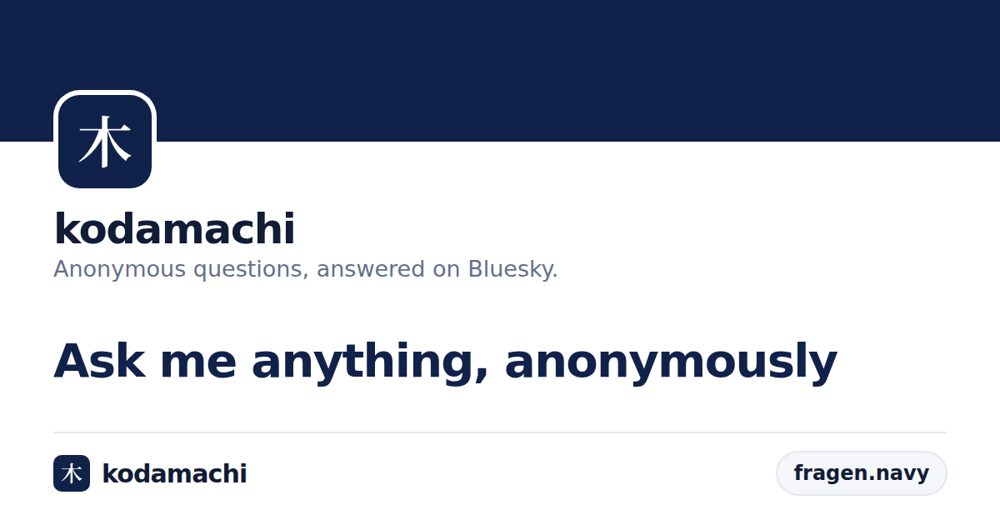

# kodamachi

> FOSS, AT Protocol-native anonymous Q&A. Receive questions anonymously and answer directly to your Bluesky feed.



> **Formerly Navyfragen.** The brand changed with the redesign in `docs/design/kodamachi-handoff/`; the app lives at `kodamachi.app`, and `navyfragen.app` redirects there. The `fragen.navy` short links and the `app.navyfragen.message` lexicon are unchanged; see [#388](https://github.com/karanshukla/navyfragen-app/issues/388).

[](https://github.com/karanshukla/navyfragen-app/actions/workflows/Tests.yml)
[](https://coveralls.io/github/karanshukla/navyfragen-app?branch=main)
[](LICENSE)
[](https://bun.sh)
[](https://www.typescriptlang.org)
[](https://atproto.com)

---

## What It Does

kodamachi lets Bluesky users receive anonymous questions via a public inbox link and post answers (optionally with a styled image card) directly to their Bluesky feed. Bluesky (AT Protocol) serves as both the identity provider (OAuth) and a secondary data store via PDS sync.

The companion [navyfragen-feed](https://github.com/karanshukla/navyfragen-feed) repo is a Bluesky custom feed generator that surfaces answered questions on the network.

---

## Tech Stack

| Layer               | Technologies                                                                                               |
| ------------------- | ---------------------------------------------------------------------------------------------------------- |
| **Client**          | React 19, Vite, TypeScript, Mantine UI v9, React Query v5, React Router v8                                 |
| **Server**          | Bun.serve + Hono, TypeScript, Kysely ORM, AT Protocol SDK, Pino                                            |
| **Image rendering** | `html-to-image`: Bun + headless Chromium, renders question cards to PNG                                    |
| **Link cards**      | `opengraph-service`: Go, serves OpenGraph tags and preview images for shared links                         |
| **Database**        | SQLite (development) · PostgreSQL (production)                                                             |
| **Auth**            | AT Protocol OAuth (Bluesky as identity provider)                                                           |
| **Testing**         | Vitest + Testing Library (client) · `bun test` (server) · `go test` (opengraph-service) · Playwright (E2E) |
| **Observability**   | Pino structured logging, optional Axiom transport                                                          |

---

## Monorepo Structure

Bun workspaces (`client`, `server`, `html-to-image`) plus one Go module:

```
navyfragen-app/
├── client/             # React + Vite SPA
├── server/             # Bun.serve + Hono API
├── html-to-image/      # Headless Chromium renderer for question images
├── opengraph-service/  # Go service for link previews
├── e2e/                # Playwright specs
├── anubis/             # Anubis WAF config
├── caddy/              # Caddy reverse proxy config
├── docker/             # Dockerfiles and compose overlays
└── docs/               # Developer notes and the design handoff
```

`brand.json` at the root holds the app name, domains and the mark; the client, server and Go service all read it.

---

## Getting Started

### Prerequisites

- [Bun](https://bun.sh) (package manager and runtime — see [issue #250](https://github.com/karanshukla/navyfragen-app/issues/250))
- [Git](https://git-scm.com)
- A modern web browser
- [Node.js](https://nodejs.org) — **only** if you want to run the Playwright E2E suite locally

> **Runtime note:** Bun is the installer and the runtime for every workspace. The server has been Bun-only since #268/#288; the client's Vite dev server, build, lint, tests, and coverage now run on Bun too. Client coverage uses Vitest's istanbul provider rather than v8; v8 coverage needed a `node:inspector` API Bun only implemented in 1.4, and istanbul stays because it needs no inspector at all. See `client/README.md`.
>
> Node is needed for exactly one thing: **Playwright**, which cannot load our E2E specs under Bun. Install it only if you plan to run `bun run test:e2e` locally. Everything else works with Bun alone.

> **Windows users:** You may need the [C++ build tools](https://visualstudio.microsoft.com/visual-cpp-build-tools/) (required by `sharp`). WSL2 is recommended for the best experience. (`better-sqlite3` was removed in #288 when the Node code path was retired — SQLite now runs through `bun:sqlite`, which ships inside the Bun runtime and needs no native build.)

### Installation

1. **Clone the repository:**

   ```bash
   git clone https://github.com/karanshukla/navyfragen-app.git
   cd navyfragen-app
   ```

2. **Install all dependencies:**

   ```bash
   bun install
   ```

3. **Configure the server:**

   ```bash
   cp server/.env.template server/.env
   ```

   The template works for local development as it is, except for `OAUTH_TOKEN_SECRET`, a 32-byte hex string used for AES-256 encryption that has no default. Generate one and set it in `server/.env`:

   ```bash
   bun -e "console.log(crypto.getRandomValues(new Uint8Array(32)).toHex())"
   ```

4. **Point the client at the server:**

   ```bash
   echo "VITE_API_URL=http://127.0.0.1:8080" > client/.env.development.local
   ```

   Use `.env.development.local` rather than `client/.env`: the test runner loads `.env` too, and a value there changes what the client tests see.

5. **Start the development servers:**

   ```bash
   bun run dev
   ```

   This starts the client (port `5173`), the server (port `8080`, from the template's `PORT`) and the `html-to-image` service (port `3033`).

6. **Open the app** at `http://127.0.0.1:5173`, not `http://localhost:5173` — the AT Protocol OAuth flow and the session cookie both need `127.0.0.1`. See [Local Development: 127.0.0.1 vs localhost](#local-development-127001-vs-localhost) below.

---

## Image Generation

Responding to a message with an image card requires the in-house `html-to-image` service (located in `html-to-image/` at the repo root). It renders HTML in a headless Chromium browser and returns a screenshot.

`bun run dev` at the repo root starts it automatically alongside the client and server. To run it in isolation:

```bash
bun run --cwd html-to-image start
```

For Docker (e.g. in CI or the full stack), use:

```bash
bun run html-to-image
```

Set `EXPORT_HTML_URL=http://localhost:3033/` in `server/.env` (this is the default).

### Image Themes

Three themes are available when responding to a message:

| Theme        | Description                                                                 |
| ------------ | --------------------------------------------------------------------------- |
| `default`    | **Quote** — white card on the navy fill (the design's default)              |
| `compressed` | **Compact** — white-ruled block on midnight, for feeds read in the dark     |
| `twitter`    | **Post** — a paper post from the app's own account, with the mark as avatar |

Users pick a theme in the Image theme card on the Messages page; it is stored per-user in the database.

---

## Infrastructure

### Anubis WAF (optional but recommended)

[Anubis](https://github.com/TecharoHQ/anubis) acts as a WAF to protect public-facing pages from DDoS and spam. Configuration is in [`/anubis`](anubis/).

Pair it with a [Caddy](https://caddyserver.com) reverse proxy (a sample config is in [`/caddy`](caddy/)). Route traffic as:

```
Internet → Caddy → Anubis → Vite/Client
                 → Server (API)
```

CloudFront can also be used in place of Caddy.

### Short Links

Users share a short link to their public inbox (e.g. `fragen.navy/user123` -> `navyfragen.app/profile/user123`). Any URL-prefix-preserving redirect service works, for example [`docker-redirector`](https://github.com/Intellection/docker-redirector).

Set the shortlink base in the client's `VITE_SHORTLINK_URL` (e.g. `fragen.navy`).

---

## Development Notes

### Running Tests

```bash
# Client tests
cd client && bun run test

# Server tests
cd server && bun run test

# With coverage
cd client && bun run test:coverage
cd server && bun run test:coverage

# Link-preview service
cd opengraph-service && go test ./...
```

The client is gated at **100%** on all four metrics (statements, lines, branches, functions) with Vitest's istanbul provider. The server is gated at 97% lines through Coveralls, because Bun's built-in reporter carries lines and functions only.

The Playwright suite runs against the full Docker stack with a real Bluesky test account; setup is in [`docs/e2e-testing.md`](docs/e2e-testing.md).

### AT Protocol Lexicons

Custom lexicons live in `server/lexicons/`. Generated TypeScript types are in `server/src/lexicon/` (**do not edit them manually**). Regenerate with:

```bash
cd server && bun run lexgen
```

> **Windows users:** Run `lexgen` in WSL2. Running it natively on Windows may delete the generated files.

### Pre-commit Hook

The repo uses [Husky](https://typicode.github.io/husky/) to run checks automatically before every `git commit`. The hook runs on all platforms (macOS, Linux, Windows via Git Bash).

**What it does:**

| Step                | Tool           | Effect                                                       |
| ------------------- | -------------- | ------------------------------------------------------------ |
| Format staged files | Prettier       | Auto-fixes formatting (quotes, indentation, trailing commas) |
| Lint staged files   | oxlint         | Auto-fixes import order, unused vars, etc.                   |
| Type check client   | `tsc --noEmit` | Blocks commit if there are TypeScript errors                 |
| Type check server   | `tsc --noEmit` | Blocks commit if there are TypeScript errors                 |

The hook is installed automatically when you run `bun install` (via the `prepare` script).

To skip it in an emergency:

```bash
git commit --no-verify -m "your message"
```

### Local Development: 127.0.0.1 vs localhost

AT Protocol's OAuth implementation follows [RFC 8252](https://www.rfc-editor.org/rfc/rfc8252) loopback rules: a local client's `redirect_uri` must use the IP literal `127.0.0.1`, not the hostname `localhost`. `server/src/auth/client.ts` already hardcodes the OAuth `redirect_uri` to `http://127.0.0.1:<PORT>` for local dev, so if the server itself is bound to `localhost` instead of `127.0.0.1`, the OAuth callback silently fails — `localhost` and `127.0.0.1` can resolve to different addresses (`::1` vs `127.0.0.1`), so the server ends up listening on one while the callback hits the other.

Cookies are also host-specific: a session cookie set for `127.0.0.1` will not be sent by the browser to `localhost`, even though both point at the same machine. So every layer needs to agree on `127.0.0.1`:

1. **`server/.env`** (the template's defaults):
   ```bash
   HOST="127.0.0.1"
   CLIENT_URL="http://127.0.0.1:5173"
   ```
2. **`client/.env.development.local`** (create if it doesn't exist):
   ```bash
   VITE_API_URL=http://127.0.0.1:8080
   ```
3. **Browser:** open the app at `http://127.0.0.1:5173`, not `http://localhost:5173`.

This applies on every platform. Windows has an additional wrinkle on top: cookie `SameSite` handling differs between `127.0.0.1` and `localhost`, so Windows users should use `127.0.0.1` even when not debugging OAuth specifically.
